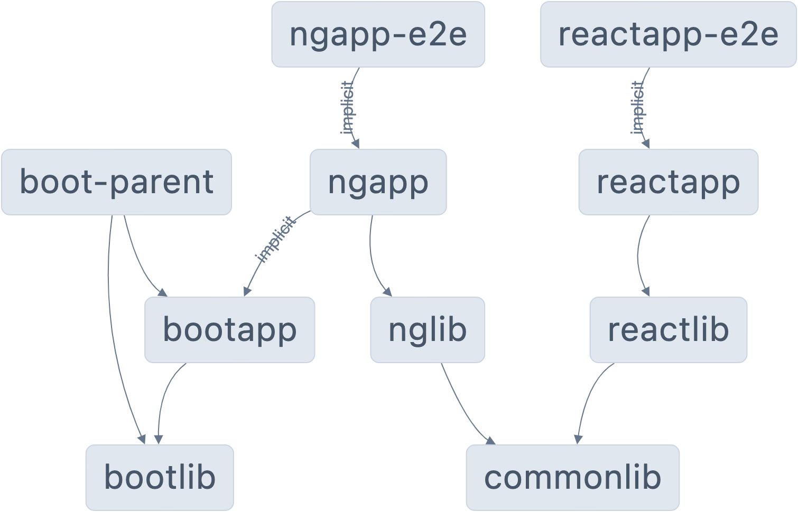

# Lab 08: _`nx migrate`_ command

We will be working on this workspace:

## Lab Setup

1. Clone the repo with: `git clone https://github.com/tinesoft/nx-multi-stacks-monorepo.git`
2. Open the folder in VSCode or IDE of choice
3. Run `npm ci` to install  necessary **NPM** dependencies

## Migrating to a specific version of Nx

1. Open a Terminal
2. Run "`npx nx migrate 17.2.4`
3. Inspect the changes in the workspace:
    * Inspect the updated `package.json` file
    * Inspect the generated `migrations.json` file
4. Follow the printed instructions
5. Run the command `npx nx run-many -t build,test` to make sure everything still **builds** and that **tests** still pass
6. Delete the `migration.json` file (no longer needed, **should not be versioned**)

## Migrating **interactivelly** to latest version of Nx

1. ⚠️ Reset the current workspace status by running Git command `git reset --hard origin/main` 
2. Run "`npx nx migrate latest --interactive` to migrate interactively
    * You will be prompted to opt-in/out to specific packages udpdates
    * Answer `Yes` for all prompts
3. Inspect the changes in the workspace:
    * Inspect the updated `package.json` file
    * Inspect the generated `migrations.json` file
4. Follow the printed instructions
5. Run the command `npx nx run-many -t build,test` to make sure everything still **builds** and that **tests** still pass
6. Delete the `migration.json` file (no longer needed, **should not be versioned**)