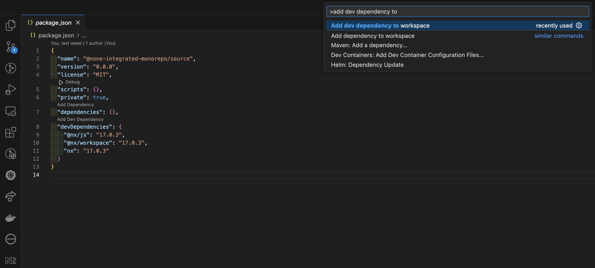
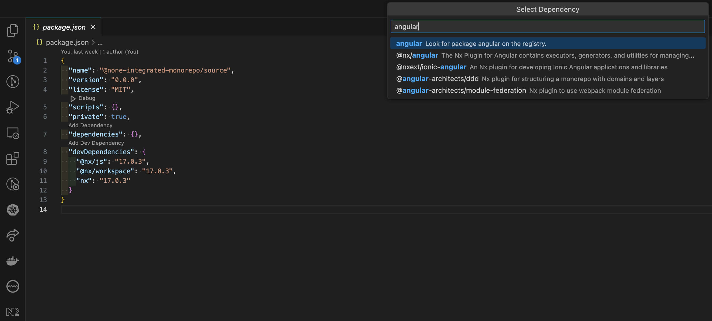
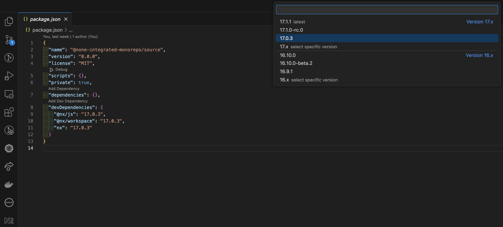
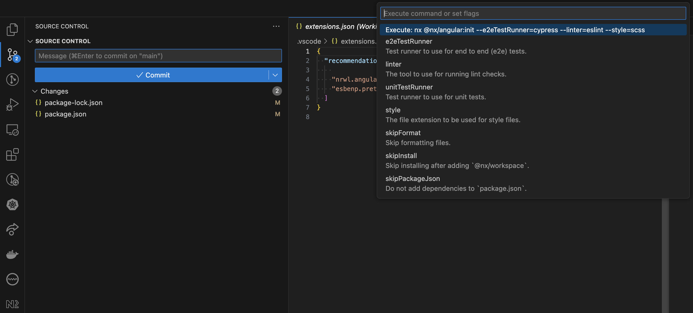
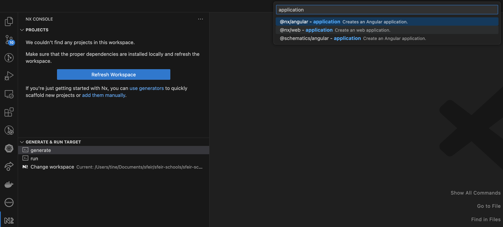
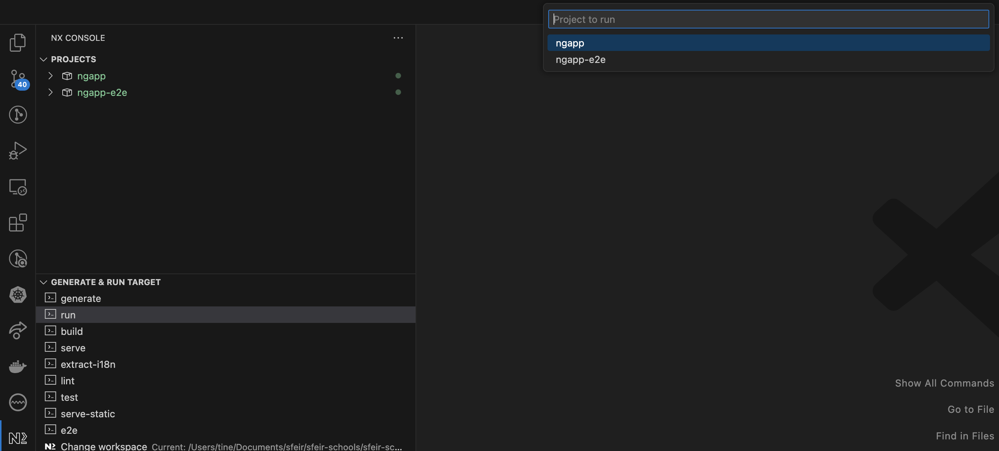

# Lab 09:  Playing with Nx Console

> ⚠️ Before you start
>
> Please open the `package.json` in `workspace/` and **note** the version of `"nx"` package from the `devDependencies` section.
>
> In this lab, we will add addtional `"@nx/*"` packages, and it is **highly recommended** to use **the same version** as `"nx"` for all of them.
>
> If your `"@nx/*"` versions do not match the version of `"nx"` in your repository, you can encounter some **difficult to debug errors**.
>
> So always [Keep Nx versions in sync!](https://nx.dev/recipes/tips-n-tricks/keep-nx-versions-in-sync)

⚠️ The bellow instructions are for `VSCode`'s `Nx Console` integration, they might slightly defer if you are using a different editor (Intellij or Neovim)

Open `workspace/` folder in VSCode

## Use `Add Dev Dependency` to add `@nx/angular` to the workspace

1. Open the Omnisearch (`CTRL+SHIFT+P` or `CMD+SHIFT+P`), type and select `"Add dev dependencies to workspace"` then press `ENTER` to confirm

2. Type `"angular"` in the next textbox, select `@nx/angular` from the list, then press `ENTER` to confirm

3. Select the same package version as existing `@nx/*` packages in `package.json`, then press `ENTER` to confirm

4. /!\ Before pressing ENTER on currently selected line (`Execute: nx @nx/angular:init`), customize the following options, by selecting and changing their default values:

    * `e2eTestRunner` → Choose `cypress`
    * `linter` → Choose `eslint`
    * `style` → Choose `scss`
5. Select again the line `Execute: nx @nx/angular:init` and  press `ENTER` to trigger the generation

## Generating an application in the workspace

1. Open the Omnisearch (`CTRL+SHIFT+P` or `CMD+SHIFT+P`), type and select `"nx generate"` then press `ENTER` to confirm

2. In the `Generate UI`, customize the following options:
    * Application name:  "`ngapp`"
    * Style: `scss`
3. Look at the console to preview what will be generated (Dry Run)
4. Press `Generate` to confirm

## Running Commands in the generated application

1. Open the Omnisearch (`CTRL+SHIFT+P` or `CMD+SHIFT+P`), type and select `"nx run"` then press `ENTER` to confirm

2. Select the `ngapp` project from the next screen
3. choose `test` task and execute it

## Exploring the workspace with project graph

1. Open the Omnisearch (`CTRL+SHIFT+P` or `CMD+SHIFT+P`), type `"nx project graph"`
2. Select `"Nx: Show full project graph"` then press `ENTER` to confirm
3. Explore the project graph
