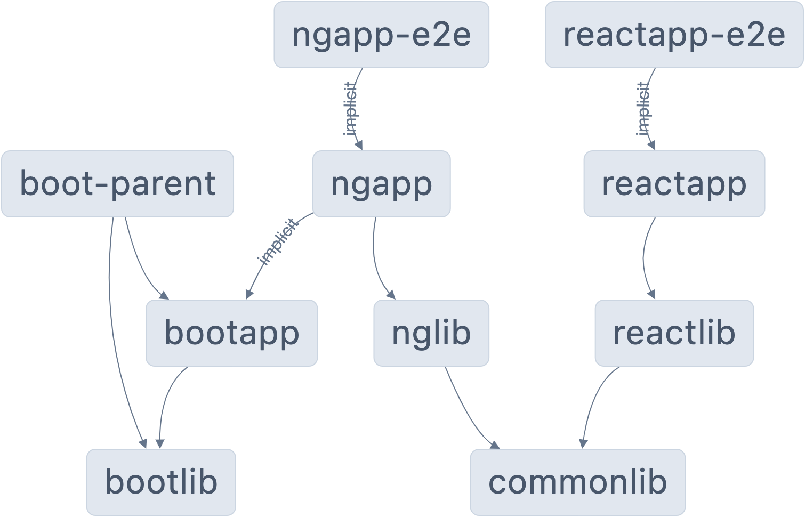

# Lab 10: Setting up Nx Cloud and CI Workflow

We will be working on this workspace:

## Lab Setup

1. Clone the repo with: `git clone https://github.com/tinesoft/nx-multi-stacks-monorepo.git`
2. Open the folder in VSCode or IDE of choice
3. Run `npm ci` to install  necessary **NPM** dependencies

## Setting Up Nx Clould for DTE

1. Run `npx nx connect`
2. Inspect what changed in the workspace

## Creating a CI workflow file

1. Run `npx nx g @nx/workspace:ci-workflow`
    * CI Provider: `Github Action`
2. Inspect what changed in the workspace
3. (Optional Step) Follow the link to **claim the workspace** (required an account on https://cloud.nx.app)
